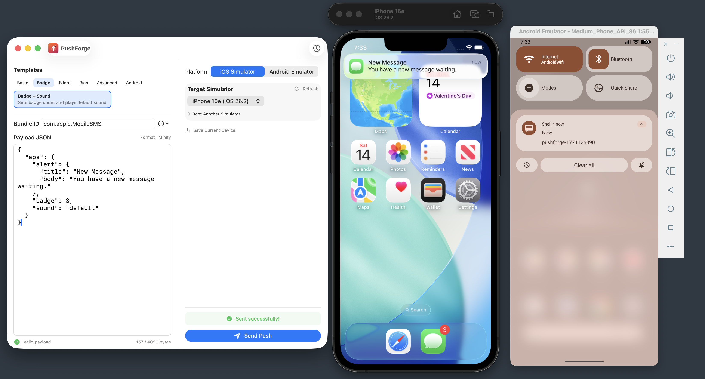

<p align="center">
  
</p>

<h1 align="center">PushForge</h1>

<p align="center">
  <strong>The push notification playground for mobile, web &amp; AI agent developers.</strong><br/>
  Craft, send, and test push payloads on iOS Simulators, Android Emulators &amp; macOS Desktop — zero config, zero cost.
</p>

<p align="center">
  <a href="https://developer.apple.com/xcode/"></a>
  <a href="https://www.apple.com/macos/"></a>
  <a href="https://swift.org"></a>
  <a href="LICENSE"></a>
  
  
  <a href="https://github.com/VikrantSingh01/PushForge/releases/latest"></a>
</p>

---

<p align="center">
  <a href="https://www.youtube.com/watch?v=JeI8qKx1KkA">
    
  </a>
  <br/>
  <em>Craft a payload, pick a target, hit Send. Notification appears instantly on iOS, Android, or macOS.</em>
  <br/>
  <a href="https://www.youtube.com/watch?v=JeI8qKx1KkA"><strong>Watch the demo video</strong></a>
  &nbsp;|&nbsp;
  <a href="https://singhvikrant.substack.com/p/ai-agents-are-going-mobile-and-push"><strong>Read the detailed post</strong></a>
</p>

---

## Why PushForge?

Every mobile developer has been here: you need to test a push notification, and what should take 10 seconds turns into a 10-minute detour:

1. Find the simulator UDID (`xcrun simctl list devices`... scroll... copy the UUID)
2. Write valid APNs JSON from memory (was it `alert.title` or `aps.alert.title`?)
3. Save it to a temp file
4. Run `xcrun simctl push <that-uuid-you-copied> <bundle-id> /path/to/file.json`
5. Typo in the JSON? Start over.

**This workflow breaks your flow dozens of times a day.**

PushForge eliminates every step. Open the app, pick a template, hit Send. The notification appears instantly. No terminal. No UUIDs. No temp files. No broken JSON.

### Who is this for?

- **iOS developers** testing notification handling, deep links, or UI updates triggered by push
- **Android developers** testing notification behavior on emulators
- **AI/Agent developers** testing task-complete, streaming-done, and approval notifications
- **Web/Desktop developers** previewing how push notifications look in macOS Notification Center
- **QA engineers** verifying notification content, badge counts, and sound behavior
- **Backend developers** validating push payload structure before deploying

### How it compares

| Tool | Platform | iOS Sim | Android Emu | Desktop | Free | Maintained |
|---|---|---|---|---|---|---|
| **PushForge** | macOS (native) | Yes | Yes | Yes | Yes | Yes |
| Knuff | macOS | No | No | No | Yes | Abandoned (2019) |
| NWPusher | macOS | No | No | No | Yes | Archived |
| Pusher | macOS | Yes | No | No | No ($15) | Yes |
| curl + terminal | Any | Yes | No | No | Yes | N/A |

PushForge is the only **free, multi-platform push notification tool** with a native macOS UI.

---

## Features

### Multi-Platform Push

| Target | How it works | Setup needed |
|---|---|---|
| **iOS Simulator** | `xcrun simctl push` | Xcode |
| **Android Emulator** | `adb shell cmd notification post` | Android Studio |
| **Desktop** | `osascript` with target app icon | None |

Switch between platforms with a segmented picker. Template tabs, bundle ID dropdown, and validation all sync automatically.

### Core Features

- **37 Built-in Templates** — iOS (APNs), Android (FCM), Desktop (Web Push format), and AI Agent patterns
- **Platform-Synced UI** — iOS/Android/Desktop template tabs sync with send panel target; switching one switches both
- **Syntax-Highlighted JSON Editor** — NSTextView-backed editor with token colors, line numbers, bracket matching, format/minify, Cmd+/Cmd- zoom
- **Smart JSON Diagnostics** — Detects smart quotes, trailing commas, mismatched braces with exact line:col and fix suggestions
- **Auto-fix** — One-click repair for smart quotes and copy-paste artifacts from docs/Slack/email
- **Platform Mismatch Warnings** — Orange warning if iOS payload targets Android or vice versa (all 6 combos)
- **Contextual Send Button** — Shows "Send to iPhone 16e" / "Send to Pixel 7" / "Send to Desktop"
- **One-Click Simulator Boot** — Boot any iOS Simulator directly from PushForge
- **Bundle ID Picker** — Dropdown with 45+ pre-installed app IDs across all platforms (including Microsoft Teams)
- **Target App Icon** — Desktop notifications show the selected app's icon (only if the app is running — never launches apps)
- **Notification History** — Every sent notification logged with status, timestamp, full payload (SwiftData)
- **Save Devices** — Label and save simulator + bundle ID combos for quick reuse
- **External Template Files** — Templates loaded from JSON files; drop new ones in `~/Library/Application Support/PushForge/Templates/`
- **Async Performance** — ShellExecutor runs on background GCD threads, not the cooperative thread pool
- **Keyboard Shortcuts** — Cmd+Enter to send, Cmd+0 to reset zoom
- **Lightweight** — Native SwiftUI, no Electron, no external dependencies

---

## Push Payload Formats — iOS vs Android vs Desktop

Push notification payloads are **fundamentally different** across platforms. PushForge handles all three. Desktop mode uses Web Push JSON format and delivers via macOS Notification Center (`osascript`) — it previews notification content, not the Web Push API itself.

<table>
<tr><th>Feature</th><th>iOS (APNs)</th><th>Android (FCM)</th><th>Desktop (Web Push format)</th></tr>
<tr><td><strong>Root key</strong></td><td><code>aps</code></td><td><code>notification</code> / <code>data</code></td><td>Top-level</td></tr>
<tr><td><strong>Title</strong></td><td><code>aps.alert.title</code></td><td><code>notification.title</code></td><td><code>title</code></td></tr>
<tr><td><strong>Body</strong></td><td><code>aps.alert.body</code></td><td><code>notification.body</code></td><td><code>body</code></td></tr>
<tr><td><strong>Badge</strong></td><td><code>aps.badge</code> (number)</td><td><code>notification_count</code></td><td><code>badge</code> (icon URL)</td></tr>
<tr><td><strong>Sound</strong></td><td><code>aps.sound</code></td><td><code>notification.sound</code></td><td>N/A (OS default)</td></tr>
<tr><td><strong>Image</strong></td><td><code>mutable-content</code> + Service Extension</td><td><code>notification.image</code> (URL)</td><td><code>image</code> (URL)</td></tr>
<tr><td><strong>Actions</strong></td><td><code>category</code> (registered in app)</td><td><code>click_action</code></td><td><code>actions[]</code> array</td></tr>
<tr><td><strong>Grouping</strong></td><td><code>thread-id</code></td><td><code>tag</code> + <code>channel_id</code></td><td><code>tag</code></td></tr>
<tr><td><strong>Priority</strong></td><td><code>interruption-level</code></td><td><code>android.priority</code></td><td><code>requireInteraction</code></td></tr>
<tr><td><strong>Silent/Data</strong></td><td><code>content-available: 1</code></td><td><code>data</code> (no <code>notification</code>)</td><td>N/A</td></tr>
<tr><td><strong>Max payload</strong></td><td>4,096 bytes</td><td>4,096 bytes</td><td>~4,078 bytes</td></tr>
</table>

<details>
<summary><strong>Example — same notification across platforms</strong></summary>

**iOS (APNs):**
```json
{
  "aps": {
    "alert": { "title": "New Message", "body": "You have a new message waiting." },
    "badge": 3, "sound": "default"
  }
}
```

**Android (FCM):**
```json
{
  "notification": {
    "title": "New Message", "body": "You have a new message waiting.",
    "sound": "default", "notification_count": 3, "channel_id": "messages"
  }
}
```

**Desktop (Web Push format):**
```json
{
  "title": "New Message", "body": "You have a new message waiting.",
  "icon": "/icons/app-icon-192.png", "tag": "new-message"
}
```
</details>

---

## Templates

PushForge ships with **37 ready-to-use templates** organized by platform and sub-category:

### Standard Templates (24)

| Sub-Category | iOS | Android | Web |
|---|---|---|---|
| **Basic** | Basic Alert | Android Basic | Web Basic |
| **Badge** | Badge + Sound | Android Badge + Sound | — |
| **Silent** | Silent Push, Background Sync | Android Silent, Android Data | — |
| **Rich** | Rich Media, Actionable | Android Rich, Image, Actionable | Web Actions |
| **Advanced** | Long Payload, Grouped Thread, Critical Alert, Live Activity, Time Sensitive | Android Long Payload, Grouped, High Priority, Time Sensitive | — |

### AI Agent Templates (13) — NEW

Templates for modern agentic AI patterns used by ChatGPT, Claude, Copilot:

| Pattern | iOS | Android | Web |
|---|---|---|---|
| **Task Complete** | `time-sensitive` + `thread-id` + deep link | notification + data + `click_action` | `requireInteraction` + action buttons |
| **Streaming Done** | `content-available` + token/duration metadata | chat channel + model metadata | — |
| **Needs Approval** | `category: AGENT_APPROVAL` | high priority + `APPROVE_ACTION` | Approve/Reject buttons |
| **Agent Error** | `critical` sound + `interruption-level` | alarm sound + red color | — |
| **Live Progress** | Live Activity `content-state` (75%, step 3/4) | — | — |
| **Memory Sync** | Silent `content-available: 1` | Data-only for background | — |

### AI Agent Notification Patterns Guide

> **Building an AI-powered mobile app?** PushForge ships with a companion reference covering the 12 core push notification paradigms used by ChatGPT, Claude, Copilot, Cursor, and Devin — with exact payload examples, attribute-level annotations, and priority guidance for every pattern.

**[Read the Agentic Push Notification Patterns Guide →](AGENTIC_NOTIFICATION_PATTERNS.md)**

| Pattern | When to use it | iOS interruption level |
|---|---|---|
| **Task Completion** | Agent finished async work — user needs to see the result | `time-sensitive` |
| **Human-in-the-Loop Approval** | Agent blocked on a consequential decision | `time-sensitive` + `category` |
| **Agent Error & Recovery** | Automatic retries exhausted — user must intervene | `critical` |
| **Background Memory Sync** | Agent refreshing context — user sees nothing | `content-available: 1` |
| **Streaming Response Complete** | LLM finished generating while app was backgrounded | `active` + `content-available` |
| **Live Progress Updates** | Step-by-step progress for long-running tasks | Live Activity `content-state` |
| **Multi-Agent Handoff** | Triage agent transferred request to a specialist | `active` |
| **Proactive Recommendations** | Agent noticed something useful — not user-triggered | `passive` |
| **Scheduled Agent Reports** | Daily/weekly digest delivered on a schedule | `active` |
| **Monitoring & Observability** | Agent performance degraded in production | `critical` |
| **Conversational Follow-Up** | Agent has a follow-up question or new information | `active` |
| **Autonomous Code Review** | AI-authored PR ready for human review | `active` |

Each pattern includes ready-to-send iOS and Android payloads, attribute-by-attribute annotations, and a priority rationale — paired with the matching PushForge template so you can test the exact payload in one click.

---

### Custom Templates

Drop a `.json` file into `~/Library/Application Support/PushForge/Templates/` and it appears in the app:

```json
{
  "id": "my_custom",
  "name": "My Custom Template",
  "description": "Custom notification payload",
  "category": "alert",
  "payload": {
    "aps": { "alert": { "title": "Custom", "body": "Hello!" } }
  }
}
```

User templates override bundled ones with the same ID. Organize by subdirectory (`ios/`, `android/`, `web/`).

---

## Download

**[Download PushForge.dmg (v0.9.0)](https://github.com/VikrantSingh01/PushForge/releases/latest/download/PushForge.dmg)** — open the DMG, drag to Applications, done.

> **First launch:** PushForge is not notarized yet. Right-click the app → **Open** → **Open** to bypass Gatekeeper.

### Requirements

- macOS 14 (Sonoma) or later
- Xcode 16+ with iOS Simulator runtimes (for iOS)
- Android Studio with ADB (for Android — optional)

---

## Quick Start

### Build from Source

```bash
git clone https://github.com/VikrantSingh01/PushForge.git
cd PushForge
brew install xcodegen
xcodegen generate
open PushForge.xcodeproj
```

Or build from command line:

```bash
xcodebuild -project PushForge.xcodeproj -scheme PushForge -destination 'platform=macOS' build
```

### First Push in 30 Seconds

1. Launch PushForge
2. Select a platform: **iOS Simulator**, **Android Emulator**, or **Desktop**
3. For iOS: click **Boot** next to any simulator. For Desktop: it's always ready.
4. Pick a template and select an app from the bundle ID dropdown
5. Press **Cmd+Enter** or click **Send Push**

### Run Tests

```bash
xcodebuild -project PushForge.xcodeproj -scheme PushForgeTests -destination 'platform=macOS' test
```

23 tests: payload validation (14), template integrity (7), shell execution (2).

---

## Architecture

```
PushForge/
├── Models/
│   ├── PayloadTemplate.swift         Platform + Category + payload string
│   ├── SavedDevice.swift             @Model — persisted device + bundle ID
│   └── NotificationRecord.swift      @Model — sent notification history
├── Services/
│   ├── SimulatorBridge.swift         actor — xcrun simctl wrapper
│   ├── ADBBridge.swift               actor — adb shell wrapper
│   ├── DesktopNotificationBridge.swift  actor — osascript with app icon detection
│   ├── PayloadValidator.swift        Smart JSON diagnostics + platform mismatch
│   └── TemplateManager.swift         Loads 37 JSON templates from bundle + user dir
├── ViewModels/
│   ├── PayloadComposerViewModel.swift  Template selection + payload state
│   └── DeviceManagerViewModel.swift    Device discovery + send flow + history
├── Views/
│   ├── ContentView.swift             HSplitView root layout
│   ├── TemplatePickerView.swift      iOS/Android/Web tabs + sub-categories
│   ├── PayloadComposerView.swift     JSON editor + validation bar
│   ├── JSONEditorView.swift          NSViewRepresentable — syntax highlighting, line numbers, bracket matching
│   ├── SendPanelView.swift           Device picker + contextual send button
│   ├── BundleIDPickerView.swift      45+ apps dropdown, platform-aware
│   ├── SimulatorPickerView.swift     Boot/select iOS simulators
│   ├── AndroidEmulatorPickerView.swift  ADB emulator selector
│   ├── StatusBannerView.swift        Animated success/failure/sending states
│   ├── HistoryView.swift             SwiftData query + clear all
│   └── HistoryRowView.swift          Expandable history entry
├── Utilities/
│   ├── ShellExecutor.swift           Async Process on GCD (not cooperative pool)
│   └── JSONFormatter.swift           Pretty-print + minify
└── Resources/
    └── Templates/                    37 JSON files in ios/, android/, web/
```

**Key design decisions:**

- **Async ShellExecutor** — `DispatchQueue.global` + `withCheckedThrowingContinuation` (not actor serialization)
- **SwiftData persistence** — Notification history and saved devices survive app restarts
- **External JSON templates** — Runtime extensible, user-overridable, organized by platform
- **Bidirectional platform sync** — Template tabs and send panel target are always in sync
- **Platform-aware validation** — Warns when payload format doesn't match target platform
- **Smart quote prevention** — Disabled at OS level + real-time auto-replacement in editor
- **NSTextView JSON editor** — `JSONEditorView` (NSViewRepresentable) delivers syntax highlighting, line numbers, and bracket matching not available in SwiftUI's `TextEditor`

---

## Roadmap

- [x] **v0.1** — iOS Simulator push with payload composer
- [x] **v0.2** — Android Emulator push via ADB
- [x] **v0.3** — Desktop notifications via macOS Notification Center
- [x] **v0.4** — Smart JSON diagnostics with auto-fix
- [x] **v0.5** — Multi-platform bundle ID picker (45+ apps)
- [x] **v0.6** — External JSON templates with runtime extensibility
- [x] **v0.7** — Platform sync, mismatch warnings, consistent sub-categories
- [x] **v0.8** — Visual redesign (SF Symbol icons, color-coded tabs, contextual send button)
- [x] **v0.9** — AI Agent templates (task complete, streaming done, approval, error, live progress)
- [ ] **v1.0** — APNs push to real iOS devices (.p8 token-based auth)
- [ ] **v1.1** — FCM push to real Android devices (service account)
- [ ] **v1.2** — Live notification preview panel (mock rendering)
- [ ] **v1.3** — CLI companion (`pushforge send --template agent_task_complete.json`)
- [ ] **v1.4** — Homebrew cask distribution

---

## Common Bundle IDs

<details>
<summary><strong>iOS Simulator</strong> (15 apps)</summary>

| App | Bundle ID |
|---|---|
| Settings | `com.apple.Preferences` |
| Safari | `com.apple.mobilesafari` |
| Messages | `com.apple.MobileSMS` |
| Maps | `com.apple.Maps` |
| Calendar | `com.apple.mobilecal` |
| Photos | `com.apple.mobileslideshow` |
| Notes | `com.apple.mobilenotes` |
| Contacts | `com.apple.MobileAddressBook` |
| Reminders | `com.apple.reminders` |
| Clock | `com.apple.mobiletimer` |
| Weather | `com.apple.weather` |
| Files | `com.apple.DocumentsApp` |
| Camera | `com.apple.camera` |
| Health | `com.apple.Health` |
| Microsoft Teams | `com.microsoft.skype.teams` |

</details>

<details>
<summary><strong>Android Emulator</strong> (15 apps)</summary>

| App | Bundle ID |
|---|---|
| Settings | `com.android.settings` |
| Contacts | `com.android.contacts` |
| Phone | `com.android.dialer` |
| Messages | `com.android.messaging` |
| Calendar | `com.android.calendar` |
| Camera | `com.android.camera2` |
| Gallery | `com.android.gallery3d` |
| Chrome | `com.android.chrome` |
| Gmail | `com.google.android.gm` |
| Google Maps | `com.google.android.apps.maps` |
| YouTube | `com.google.android.youtube` |
| Play Store | `com.android.vending` |
| Clock | `com.google.android.deskclock` |
| Calculator | `com.google.android.calculator` |
| Microsoft Teams | `com.microsoft.teams` |

</details>

<details>
<summary><strong>Desktop</strong> (15 apps)</summary>

| App | Bundle ID |
|---|---|
| Safari | `com.apple.Safari` |
| Mail | `com.apple.mail` |
| Messages | `com.apple.MobileSMS` |
| Calendar | `com.apple.iCal` |
| Notes | `com.apple.Notes` |
| Reminders | `com.apple.reminders` |
| Maps | `com.apple.Maps` |
| Finder | `com.apple.finder` |
| Music | `com.apple.Music` |
| News | `com.apple.news` |
| Slack | `com.tinyspeck.slackmacgap` |
| Microsoft Teams | `com.microsoft.teams2` |
| Chrome | `com.google.Chrome` |
| Firefox | `org.mozilla.firefox` |
| VS Code | `com.microsoft.VSCode` |

</details>

---

## Contributing

Contributions welcome! PushForge is built with SwiftUI — if you're a mobile developer, you already know the stack.

```bash
git clone https://github.com/YOUR_USERNAME/PushForge.git
cd PushForge
xcodegen generate
open PushForge.xcodeproj
```

**Good first issues:**
- Live notification preview panel (mock iOS/Android rendering)
- Homebrew cask formula
- APNs real device support (.p8 auth)
- Import/export notification collections

## License

MIT License. See [LICENSE](LICENSE) for details.

## Acknowledgments

This project was developed with assistance from **GitHub Copilot**, an AI pair programmer.

---

<p align="center">
  <strong>If PushForge saves you time, give it a &#11088;!</strong><br/><br/>
  <a href="https://github.com/VikrantSingh01/PushForge">
    
  </a>
  <br/><br/>
  <a href="https://github.com/VikrantSingh01/PushForge/stargazers">
    
  </a>
</p>
